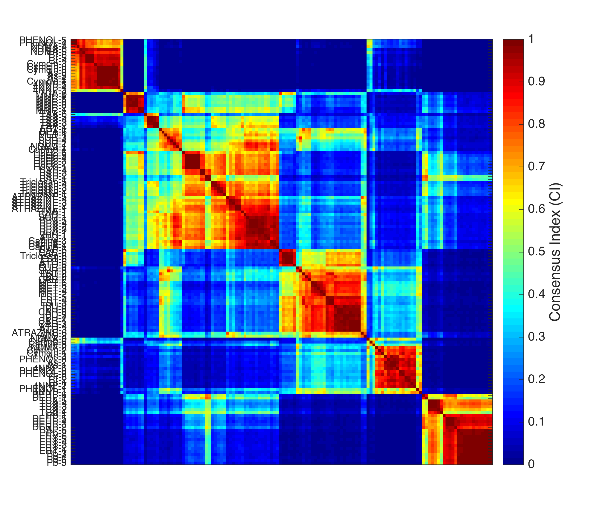
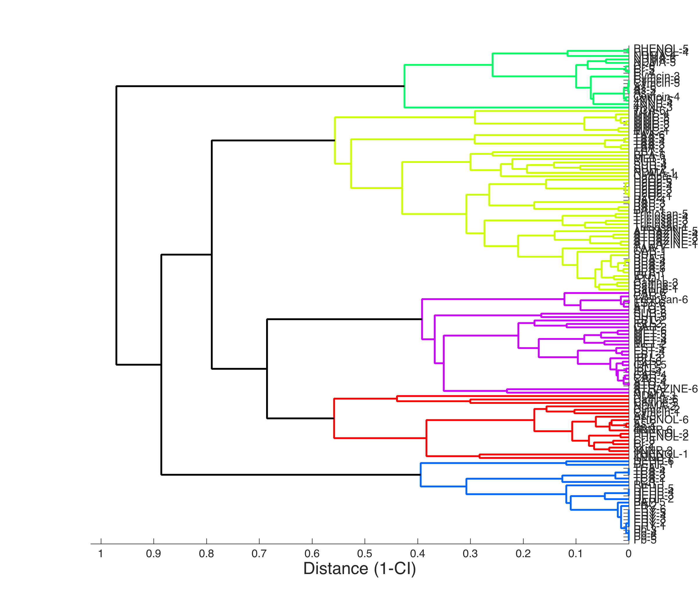

# Consensus Clustering Protocol

This protocol describes the protocol for conducting consensus clustering. The clustering is based on the the background algorithm for the clustering is the Self-Organizing Map (SOM).  

The input for the analysis can be in either excel format ``(.xls or .xlsx)`` or matlab format ``(.mat)``.

To run a matlab code ** select the codes** and press ``shift+F7`` on MAC and ``F9`` on Windows machine.
## Main code file
The main file for the analysis is the ``main_consensusClustering.m``
To conduct the analysis, open the ``main_consensusClustering.m`` file in MATLAB.

#### Initialize the paths
Run  the following section of the codes to initialize and import the required path.
```matlab
addpath(genpath('lib/'));
```
#### Select Input Data

* If the input data is in excel format ``(.xls or .xlsx)`` run the following section of code
```matlab
[data, varName, sampleName] = dataParse_clustering_excel();
```
The format of the input data file should be as follows:

Sample Name | Var 1	| Var 2 | Var 3 |... ...| Var d-1	| Var d
------------|------ |-------|-------|-------|------   |------
Sample 1	  | 6.78	| 6.31	| 9.00	|... ...| 5.94    |10.00
Sample 2	  | 1.64	| 1.03	| 1.46	|... ...| 1.04	  | 5.76
Sample 3	  | 1.58	| 1.00	| 1.40	|... ...| 1.06	  | 3.62
Sample 3	  | 1.58	| 1.00	| 1.40	|... ...| 1.06	  | 3.62
... ...     | ..... | ..... | .....	|... ...| .....   | .....
Sample n-1	| 7.78	| 6.50	| 7.96	|... ...| 7.48	  | 8.39
Sample n	  | 6.99	| 6.83	| 8.14	|... ...| 5.51	  | 6.76

* If the input data is in matlab data file format ``(.mat)`` run the following section of code
```matlab
load('data/sampleData_for_CC.mat');
```
"sampleData_for_CC" is the name of the data file

#### Run the clustering
Run the following section of the code
```matlab
% define folder and file name to save the figures.
folderName = 'figures/';  % Name of the folder to save the results
fileNameSuffix = 'Test';  % File Name modifier for the figures (will add the text to the end of the file name)
num_bootstrp = 1000; % No. of bootstrap, 1000 should be optimum

% pre-setup the SOM
[nSample, nVar] = size(data); % get no. of sample and no. of variable
[sG, mapSize] = som_make(data); % initialize the SOM
% consensus clustering
% CI = gc_CI_SOM(data_in, sG, num_bootstrp, num_resample, norep, mapsize, training, data_name)
CI = gc_CI_SOM(data, sG, num_bootstrp, nSample, 0, mapSize,[10 100], strcat('Data_',fileNameSuffix));
```
### Plot the figures
To plot the figures (dendrogram and heatmap of consensus indices) run the following section
```matlab
[ordered_ChemName, fh1, fh2] = gc_treat_som(CI,sampleName);
```
The code block will generate the following figures

**Heatmap of the Consensus Index (CI)**

**Dendrogram from the Consensus Clustering**


### Save the figures
To save the figures, run the following block of codes. The figures, the ordered sample names, and the CC results in ``.mat`` format will be saved in the Folder name provided earlier.
```matlab
% save results as .mat file
if ~exist(folderName, 'dir'), mkdir(folderName); end   % Create folder to save results if not exist
save (strcat(folderName,'Result_',fileNameSuffix,'.mat'),'CI','ordered_ChemName');

% save the dendrogram as tiff and pdf format
print (fh1,'-dtiff', '-r300', strcat(folderName,'cc_Dendogram_',fileNameSuffix,'.pdf'));
print (fh1,'-dtiff', '-r300', strcat(folderName,'cc_Dendogram_',fileNameSuffix,'.pdf'));

% save the heatmap of CI as tiff and pdf format
print (fh2,'-dtiff', '-r300', strcat(folderName,'cc_heatmap_',fileNameSuffix,'.pdf'));
print (fh2,'-dtiff', '-r300', strcat(folderName,'cc_heatmap_',fileNameSuffix,'.pdf'));

% save the ordered chemical name as the CSV file
writetable(table(ordered_ChemName,'variablenames',...
    {strcat('ordered_ChemName_',fileNameSuffix)}),...
    strcat(folderName,'ordered_ChemName_',fileNameSuffix,'.csv'));
```
